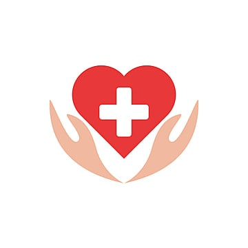

# CalmConnect - Mental Health Support Platform



CalmConnect is a comprehensive mental health support platform designed to provide resources, expert guidance, and community support for individuals seeking to improve their mental well-being.

## 🌟 Features

- **Personalized Mental Health Resources**: Access curated materials on stress management and self-care
- **Expert Consultations**: Book sessions with mental health professionals
- **Physical Health Assessment**: Get personalized exercise and diet recommendations
- **Community Support**: Connect with others on similar journeys
- **Secure Platform**: Confidential and private mental health support

## 🚀 Getting Started

To run this project locally:

1. Clone the repository:
   ```bash
   git clone https://github.com/bhargav-anagani/CalmConnect.git
